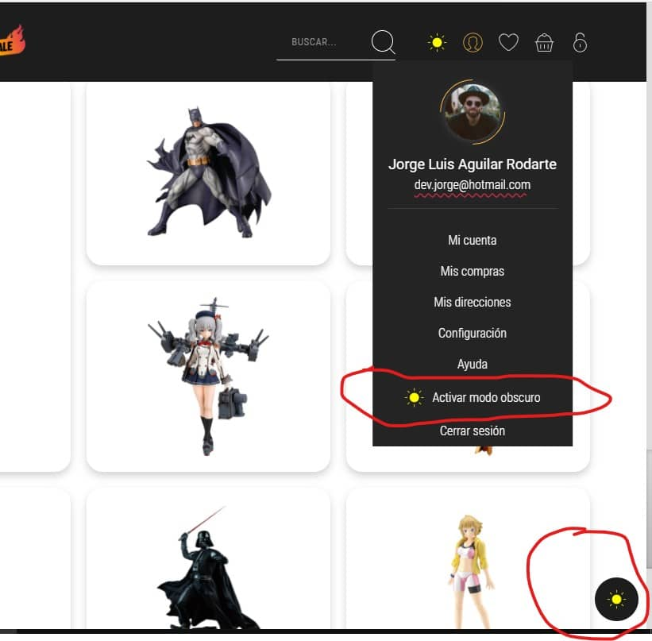
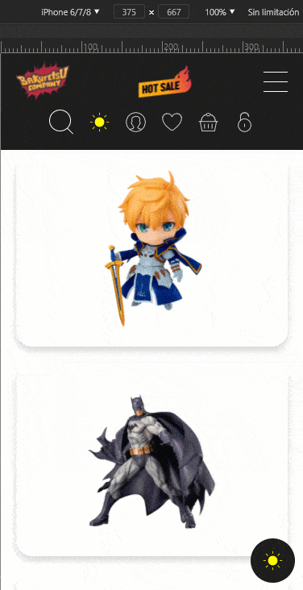
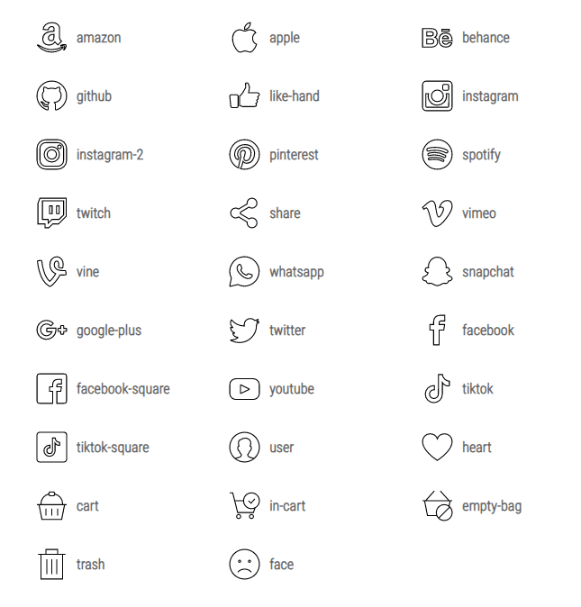
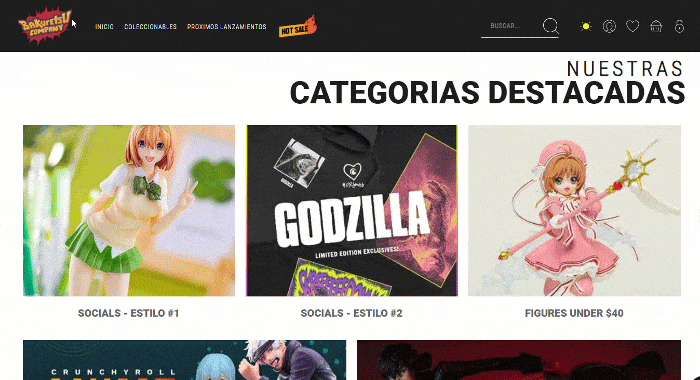
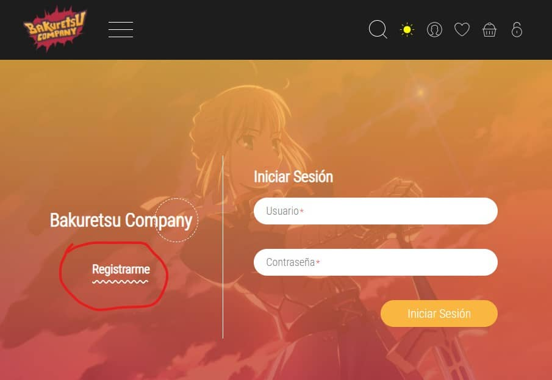
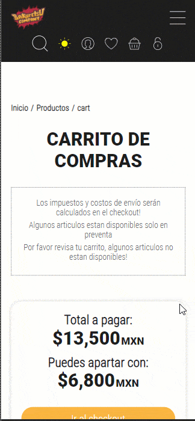

# Changelog
<p align="center">
  
</p>

>
> **Tags:**
> - :boom:       [ Cambio importante ]
> - :eyeglasses: [ Cumplimiento de especificaciones ]
> - :rocket:     [ Nueva caracteristica ]
> - :bug:        [ Bug Fix ]
> - :nail_care:  [ Mejora ]

我用中文寫了些東西，使它看起來更專業 😎

## v1.1.0 (2021-05-22)

#### :nail_care: Switch de DarkTheme
  Se agregaron botones del switch para el `DarkTheme` para que puedan elegir donde lo quieren

  
  
  * Puedes poner el boton dentro de cualquier `bakuretsu_drop > dropContent > wrapper` (como si fuera un link)
  ```html
  <li class="link themeToggle inDropThemeToggle">
    <span class="inDropThemeToggleWrapper">
      <div class="bakuretsu_icono themeToggle">
        <svg class="light" xmlns="http://www.w3.org/2000/svg" viewBox="0 0 64 64">
          <circle cx="32" cy="32" r="14"></circle>
          <path d="M32 2v8m0 44v8m30-30h-8m-44 0H2m8.8-21.2l5.6 5.6m31.2 31.2l5.6 5.6m0-42.4l-5.6 5.6M16.4 47.6l-5.6 5.6">
          </path>
        </svg>
        <svg class="dark" xmlns="http://www.w3.org/2000/svg" viewBox="0 0 64 64">
          <path d="M35 2a25 25 0 0 1-22 36.8 24.9 24.9 0 0 1-10.6-2.3A30 30 0 1 0 35 2z"></path>
        </svg>
      </div>
      <span class="animLabel"></span>
    </span>
  </li>
  ```

  * Tambien puedes poner el boton flotante(fixed) dentro de la pagina
  ```html
  <div class="bakuretsu_fixedButton bakuretsu_icono themeToggle">
      <svg class="light" xmlns="http://www.w3.org/2000/svg" viewBox="0 0 64 64">
        <title>Activar tema obscuro</title>
        <circle cx="32" cy="32" r="14"></circle>
        <path d="M32 2v8m0 44v8m30-30h-8m-44 0H2m8.8-21.2l5.6 5.6m31.2 31.2l5.6 5.6m0-42.4l-5.6 5.6M16.4 47.6l-5.6 5.6">
        </path>
      </svg>
      <svg class="dark" xmlns="http://www.w3.org/2000/svg" viewBox="0 0 64 64">
        <title>Activar tema claro</title>
        <path d="M35 2a25 25 0 0 1-22 36.8 24.9 24.9 0 0 1-10.6-2.3A30 30 0 1 0 35 2z"></path>
      </svg>
    </div>
  ```

#### :bug: Drops del menu no se despliegan correctamente
  Se corrigio el desbordamiento de los drops del menu en version mobile

  

#### :rocket: Touch actions para los sliders (mobile)
  Ahora los elementos `bakuretsu_slider` tienen soporte para moverse con los dedos en dispositivos mobiles

#### :rocket: Set de iconos
  Se agrego un set de iconos para usarse en la plantilla
  * Para usar un icono se debe de agregar la clase `baku-icon` al elemento HTML que sera el icono (se recomienda la etiqueta `i` aunque se puede usar cualquier otra), tambien es necesario indicar el nombre del icono en el atributo `data-baku-icon`
  ```html
  <i class="baku-icon" data-baku-icon="twitter"></i>
  ```
  Internamente, el icono que declares en el html se convierte en un elemento `bakuretsu_icono`.
  
  Tomando en cuenta el ejemplo anterior, el resultado final sera el siguiente:
  ```html
  <div class="bakuretsu_icono ">
    <svg xmlns="http://www.w3.org/2000/svg" viewBox="0 0 64 64">
      <path d="M60.448 15.109a24.276 24.276 0 0 1-3.288.968.5.5 0 0 1-.451-.853 15.146 15.146 0 0 0 3.119-4.263.5.5 0 0 0-.677-.662 18.6 18.6 0 0 1-6.527 2.071 12.92 12.92 0 0 0-9-3.75A12.363 12.363 0 0 0 31.25 20.994a12.727 12.727 0 0 0 .281 2.719c-9.048-.274-19.61-4.647-25.781-12.249a.5.5 0 0 0-.83.073 12.475 12.475 0 0 0 2.956 14.79.5.5 0 0 1-.344.887 7.749 7.749 0 0 1-3.1-.8.5.5 0 0 0-.725.477 11.653 11.653 0 0 0 7.979 10.567.5.5 0 0 1-.09.964 12.567 12.567 0 0 1-2.834 0 .506.506 0 0 0-.536.635c.849 3.282 5.092 7.125 9.839 7.652a.5.5 0 0 1 .267.87 20.943 20.943 0 0 1-14 4.577.5.5 0 0 0-.255.942 37.29 37.29 0 0 0 17.33 4.266 34.5 34.5 0 0 0 34.687-36.182v-.469a21.11 21.11 0 0 0 4.934-4.839.5.5 0 0 0-.58-.765z"></path>
    </svg>
  </div>
  ```

  * Tambien es posible (por si lo requieres) agregar clases extra a los iconos. Para esto, es necesario pasar las o la clase que quieras en un atributo `data-baku-extraclass`. Si agregas mas de una clase es necesario separarlas por coma (`,`).
  ```html
  <i class="baku-icon" data-baku-icon="facebook" data-baku-extraclass="claseExtra1,claseExtra2,claseExtra3"></i>
  ```
  Tomando en cuenta el ejemplo anterior, el resultado final sera el siguiente:
  ```html
  <div class="bakuretsu_icono claseExtra1 claseExtra2 claseExtra3">
    <svg xmlns="http://www.w3.org/2000/svg" viewBox="0 0 64 64">
      <path d="M60.448 15.109a24.276 24.276 0 0 1-3.288.968.5.5 0 0 1-.451-.853 15.146 15.146 0 0 0 3.119-4.263.5.5 0 0 0-.677-.662 18.6 18.6 0 0 1-6.527 2.071 12.92 12.92 0 0 0-9-3.75A12.363 12.363 0 0 0 31.25 20.994a12.727 12.727 0 0 0 .281 2.719c-9.048-.274-19.61-4.647-25.781-12.249a.5.5 0 0 0-.83.073 12.475 12.475 0 0 0 2.956 14.79.5.5 0 0 1-.344.887 7.749 7.749 0 0 1-3.1-.8.5.5 0 0 0-.725.477 11.653 11.653 0 0 0 7.979 10.567.5.5 0 0 1-.09.964 12.567 12.567 0 0 1-2.834 0 .506.506 0 0 0-.536.635c.849 3.282 5.092 7.125 9.839 7.652a.5.5 0 0 1 .267.87 20.943 20.943 0 0 1-14 4.577.5.5 0 0 0-.255.942 37.29 37.29 0 0 0 17.33 4.266 34.5 34.5 0 0 0 34.687-36.182v-.469a21.11 21.11 0 0 0 4.934-4.839.5.5 0 0 0-.58-.765z"></path>
    </svg>
  </div>
  ```

  * Lista de iconos disponibles hasta el momento:

  

#### :nail_care: Redes sociales en tarjetas de Colaboradoras
  Se mejoro la tarjeta de tal manera que ahora puedes incluir las redes sociales para que aparezcan cuando se hace hover. Antes la tarjeta era una etiqueta `a` pero ahora para este tipo es necesario que sea un `div` porque ahora lo que tendra enlace seran los iconos sociales. Para usar este tipo de card es necesario agregar la clase extra `bakuretsu_girl` y dentro de ese elemento hacer un `div` con la clase `socials` donde se meteran todos los iconos. Para usar el estilo #2 al div `socials` hay que agregarle la clase extra `vertical`
  Existen dos tipos de estilo:

  

  * Estilo #1 (redes sociales en horizontal)
  ```html
  <div class="card bakuretsu_girl" style="background-image: url(./img/cat1.jpg);">
    <div class="socials">
      <a class="socialIcon" href="#">
        <i class="baku-icon" data-baku-icon="facebook"></i>
      </a>
      <a class="socialIcon" href="#">
        <i class="baku-icon" data-baku-icon="twitter"></i>
      </a>
    </div>
    <div class="texto">
      <p>Best Girl</p>
    </div>
  </div>
  ```

  * Estilo #2 (redes sociales en vertical)
  ```html
  <div class="card bakuretsu_girl" style="background-image: url(./img/cat2.jpg);">
    <div class="socials vertical">
      <a class="socialIcon" href="#">
        <i class="baku-icon" data-baku-icon="facebook"></i>
        <p>Facebook</p>
      </a>
      <a class="socialIcon" href="#">
        <i class="baku-icon" data-baku-icon="twitter"></i>
        <p>Twitter</p>
      </a>
    </div>
    <div class="texto">
      <p>CR Loves: Godzilla</p>
    </div>
  </div>
  ```


#### :bug: Fix: Decoración ondulada
  Se corrigio la decoración ondulada que no se mostraba bien en el boton de "registrarme" (dentro de la vista: auth).

  

#### :nail_care: Call to action al checkout
  Se evaluó la opción de agregar el botón del checkout arriba y abajo de los artículos y se tomo la desición (en base a analisis de UX) de poner el **call to action** en ambas posiciones (arriba y abajo) para no perder una compra potencial al momento de deslizar hacia abajo o arriba. Todo esto solo aplica en vista movil.

  

#### :bug: Fix: Signo de precio desaparecido
  Se corrigio el error que hizo que desapareciera el signo de pesos en las tarjetas del producto.